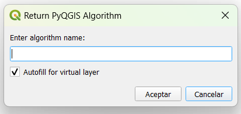
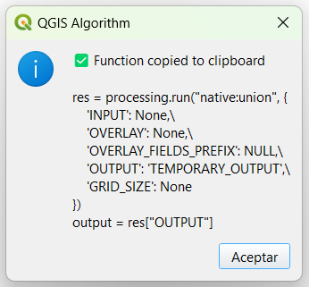

**Return QGIS Algorithm**

Currently supports:
- Zero-click searching and copying of a given QGIS algorithm
- Automatic addition of result layer extraction (because that's what you wanted anyway)
- Ctrl+Alt+Space to open the tool
- Output automatically copied to clipboard

  
*Image 1: View upon opening*

  
*Image 2: View after selecting a tool*
